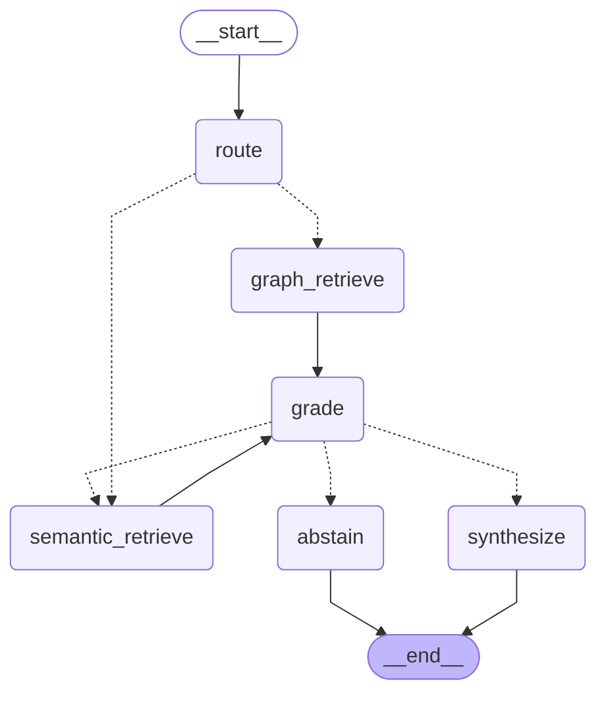

# Agent Design

One LangGraph agent: six nodes, a parallel fan-out, and a grading cycle.

## Why one agent and not several

The work here is retrieve-then-answer over two stores. A supervisor delegating to
a "graph specialist" and a "vector specialist" would add message passing and a
second LLM hop to make a decision the routing node already makes correctly - the
routing spot check is 12/12 - and it would bury that decision inside inter-agent
chatter.

A single `StateGraph` is the *more* convincing LangGraph demonstration, because
the state design and the whole control flow are visible in one diagram. Multi-agent
would be the right answer if the sub-tasks needed genuinely different tools,
prompts or models. They do not.

## The graph



## Nodes

| Node | Does | LLM call |
|---|---|---|
| `route` | Classifies into graph / semantic / both, and names a Cypher template | yes, structured |
| `graph_retrieve` | Entity-links, selects a template, guards it, executes read-only, linearises rows | no |
| `semantic_retrieve` | Embeds locally, searches LanceDB, applies the relevance floor | no |
| `grade` | Can this context answer the question? | yes, structured (skipped when there is no context) |
| `synthesize` | Grounded answer with citations | yes |
| `abstain` | Declines honestly | no |

Nodes are built by factories that close over the stores. LangGraph nodes receive
only state, so closing over dependencies is how they reach a database without
constructing a driver per request.

## State and the reducers

`AgentState` is a `TypedDict`. Three fields carry `operator.add` reducers:

```python
graph_rows: Annotated[list[dict], operator.add]
chunks: Annotated[list[dict], operator.add]
retrieval_context: Annotated[list[str], operator.add]
```

These are load-bearing. When the router picks `both`, the edge function returns
**a list of node names**, which makes LangGraph run both retrievers in the same
superstep - concurrently, not in sequence. Their writes then merge through the
reducers. Without them the second branch to finish would silently overwrite the
first, and only on "both" questions.

That concurrency is also why `LanceDBVectorStore` pushes its synchronous work to
a worker thread: blocking the event loop there would serialise the two branches
and remove the benefit.

## The cycle

`grade -> semantic_retrieve -> grade` is a real cycle, not a pipeline. A
graph-only question whose traversal came back thin is retried once against the
corpus with a wider `k`; already-seen chunks are filtered out, because the
reducer appends rather than replaces.

Capped at one retry. A thin result is usually a missing fact, and looping on it
only spends tokens.

## Abstention, and the bug that made it necessary

An early version answered whenever *any* context had been retrieved, reasoning
that a caveated answer beats a refusal. An off-domain probe showed that was
wrong: vector search always returns its k nearest neighbours however far away
they are, so `retrieval_context` was never empty and the agent never abstained.
It answered "how do I configure a Kubernetes ingress?" from agronomy chunks.

Two changes fixed it:

1. **A relevance floor** (`MIN_RELEVANCE = 0.62`). Measured against this corpus
   the populations separate cleanly - off-domain questions top out at 0.45-0.55,
   in-domain start at 0.78-0.84 - so the floor sits in the gap with margin.
2. **Trusting the grader.** When it says insufficient and retries are exhausted,
   the agent abstains instead of synthesising anyway.

A reachable abstain path is what the Phase 5 hallucination metric measures
against. Without it there is no correct-behaviour case to reward.

## Failure handling

Each LLM call has a defined fallback, because a classifier outage should not
become a failed request:

| Failure | Behaviour |
|---|---|
| Router errors | Default to `both` - one extra query, question still answered |
| Router names an unknown template | Fall back to the deterministic selector |
| Grader errors or returns empty args | Fail open: answer from the context we have |
| Synthesis errors | Return the abstain message rather than a partial answer |

The grader failing open is only safe because the relevance floor has already
removed noise-level context: an off-domain question reaches the grader with
nothing, and the deterministic branch handles it without an LLM call at all.

## Threading

An optional checkpointer enables `thread_id` continuity; the app wires
`AsyncSqliteSaver` so conversations survive a restart. It is optional so the
evaluation suite can run stateless - a checkpointed eval would let one golden's
state leak into the next.

## Verification

```bash
uv run pytest tests/unit/test_agent_graph.py   # branching logic, no services
uv run pytest tests/integration/test_agent.py  # end to end, needs a key
```

The integration suite asserts node *sequence* over `astream`, not just the final
answer. Checking output alone would pass even when the agent reached it by the
wrong path - running both retrievers on a definitional question, or skipping the
grader entirely.
